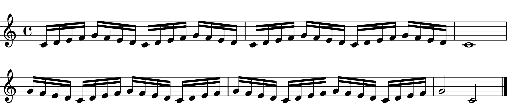

# The Sound of Teaching Music  (Experiment 1)

This repo contains scripts and materials necessary for a musical experiment with expert pianists (Experiment 1).

# experiment
- Environment: Mac OS X 10.14.3, Max MSP 7

## prerequisite
- Install the Shell package (https://github.com/jeremybernstein/shell/releases) into the package folder of Max 7.

- The Shell package is used to generate necessary folders to store collected data. If it does not work in your environment, please create the following 4 folders manually.
    + data (path: ~/script/Max/data)
        + practice (path: ~/script/Max/data/practice) - within the data folder
    + midi (path: ~/script/Max/midi)
        + practice (path: ~/script/Max/midi/practice) - within the midi folder
        
## main patchers
- `mainPatch.maxpat`: for the experiment
- `practicePatch.maxpat`: for practice trials
- `imagePatch.maxpat`: to display stimuli on the screen in front of a participant

## sub patchers (used by main patchers)
- `MIDInoteRecording.maxpat`: to acquire and save MIDI data
- `dataFileNaming.maxpat`: to create a file name
- `condFileReading.maxpat`: to read a condition file to determine the order of conditions for each participant

## others
- `image`: experimental stimuli
- `cond`: csv file and an excel file about the order of conditions for each participant

# analysis
- Environment: Mac OS X 10.15.7, R version 4.0.5 (2021-03-31)

## 1. preprosessor
data: `raw_data`
- `filtering.R`: to clean data and remove performance errors >> output: filtered folder
    + *In the original study, there was an coding error in Max for labelling the name of skills (either articulation or dynamics). This was corrected based on what was actually displayed to participants by checking the name of a stimulus image. See line 48.*
- `trimming_ioi.R`, `trimming_kot.R`, `trimming_vel.R`: to calculate dependent variables and remove outliers >> output: trimmed folder
- `function.R`: to detect pitch errors in a performance / insert NAs
- `ideal.txt`: the ideal sequence of the piece (used for filtering)
- `error_summary.Rmd`: summary for errors >> html file
- `included_summary.Rmd`: summary for included participants/responses >> html file

## 2. stats
- `ioi.Rmd`: analysis and plots for IOIs >> output: html file
- `articulation.Rmd`: analysis and plots for KOT/KOR >> output: html file
- `dynamics.Rmd`: analysis and plots for KV/KV-Diff >> output: html file

## demographics
data: `questionnaire.csv`
- `questionnaire.Rmd` >> output: html file

# material
## instruction
- `instruction.Rmd`: instruction sheet for an experimenter >> output: html file
- `image`: figures used in the instruction sheet
- `psd files`: images used in the instruction >> output: png files

## sheetmusic
- `ly files`: sheet music compiled by lilypond >> output: pdf files

## expstimuli
- `image_generator.ipynb`: to generate experimental stimuli (see more information on jupyter notebook) >> output: stimuli and practice folders
- `image`: used for stimuli generation

## etc
- `cropped`: cropped sheet music
- `checklist.xlsx`: a list to check each procedure during testing (for an experimenter)
