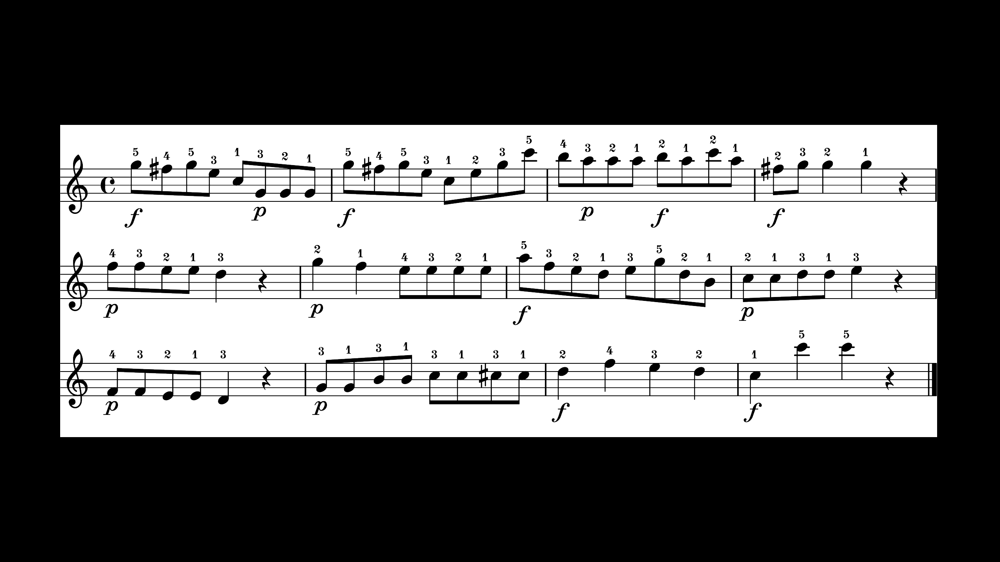

# Instruction
Author: Atsuko Tominaga - 27/06/2019 (teaching_v2.0)
- SOMBY MusicLab iMac

## PARTICIPANT RECRUITMENT:

- Pianists who are currently studying piano performance/teaching at music school / have already had a degree in piano performance/teaching
- Basic English skills

## BEFORE PARTICIPANT ARRIVES:
- Turn off WiFi connection

### Devices
1. Connect the audio interface (Focusrite Scarlett 6i6) to Macbook Pro.
2. Connect two headphones to the audio interface.
3. Connect the piano to the audio interface.
4. Turn on the piano, the audio interface and the screen in front of the piano.
5. Open “Focusrite Control” app  and click “Load from device”.

6. Go to “Device Settings” and click “LINE” for Analogue 1.

If you don’t see the images above, go to **File >> Preset >> select “Analogue + Digital”**.
Adjust the volume of the headphone so that it sounds naturally.

### Max

1. Go to **Desktop >> Atsuko_teaching-v2.0 >> open the "main.maxpat", the “practice.maxpat” and the “display.maxpat”**.
2. Move the window of the “display.maxpat” to the right (on the screen in front of the piano”) and press F for a fullscreen mode. If there is a toobar surrounding the display, get rid of it by pressing cmd+8 (not F8).
3. Read the instruction on the “main.maxpat" and the "practice.maxpat".
4. Also check whether the piano sounds come from the headphone and MIDI inputs are correctly responded (Pitch and Velocity should change according to key presses on MIDIRecording subpatchers).
5. If the sound of the metronome and the piano does not come from the computer speaker, go to **System Preference >> Sound >> Output >> select “Scarllet 6i6 USB”**.
6. If you cannot still solve the problem above, please quit Max and relaunch it again.
7. Click the “inst_1” button on the practice.maxpat to show a general instruction on the “display.maxpat”.
8. Enter SubNr for the current participant.

### Practice Patch

* Enter SubNr, BlockNr (0 for practice) (and preferred tempo (100, 110, 120) later).
* Once you entered SubNr, the order of the conditions/skills will be automatically filled.

The left panel indicates the procedure of the experiment.
1. For practice, click "Non expression" to display sheet music.
2. Ask participants to choose one of the preferred tempi. When you click one of the options, the sound of a metronome starts playing. 
3. Enter the preferred tempo.

- Start Recording (J key)
- Stop Recording (L key)
- Reset button (see the instruction on the patcher)
- inst_1: the first instruction
- inst_2: the second instruction
- inst_t: teaching instruction
- inst_p: performing instruction
- Pitch Error Detection: Both onset and offset should be correct. Otherwise, repeat a trial again (up to 5 times).

### Main Patch

- Start Recording (A key)
- Stop Recording (D key)
- Reset button (see the instruction on the patcher)

### Experimental Design 
|Condition 1 (teaching / performing)|
|-----------------------------------|
|1st Stimulus (articulation / dynamics) - Block 1|
|2nd Stimulus (dynamics / articulation) - Block 2|

|Condition 2 (performing / teaching)|
|-----------------------------------|
|1st Stimulus (articulation / dynamics) - Block 3|
|2nd Stimulus (dynamics / articulation) - Block 4|

* The order of the conditions is counterbalanced across participants.
* The order of the skills is counterbalanced across participants, but it is fixed within one condition (e.g., if a participant start with articulation and move on dynamics in the first condition, he/she will perform in the same order in the second condition.)

## WHEN PARTICIPANT ARRIVES:

- *Italic*: Verbal instruction
- >: **What to do**
- Please use a checklist to make sure you don't forget each procedure.

### Introduction
*Thank you for participating in the experiment. The aim of the experiment is to investigate how people play a piece of music expressively. The experiment is going to last about one hour.*

*If you have any questions or concerns, please ask the experimenter at any time about the nature of the study or the methods we are using. Also, you have the right to withdraw from the experiment at any time.*

*Before we start the experiment, please read the information sheet carefully and fill it out if you agree to take part in the study.*

> **Collect the informed consent form**

### Warm-up session
*Now, you are going to play what you practised during the experiment. Before we start testing, I would like you to practise your favourite pieces / exercises so that you can get used to the digital piano. When you think that you can comfortably perform music with this piano, please let me know.*

> **Experimenter should leave the room / Let participants practise their favourite pieces alone**

### Pre-check session
> **Open practice.maxpat**

> **Click “inst_1”**

> **Ask participants to choose one of the favourite tempi**

*Please practise until you feel that you comfortably perform the piece without pitch errors. After practice, we will have a brief test to make sure you can perform the piece. Let me know when you are ready for the brief test.*

> **Let the participant practise the piece (100, 110, 120 bpm)**

> **Click "inst_2"**

> **Check whether he or she can produce the sound without pitch errors twice consecutively**

- If he or she cannot perform the piece without errors within **5 attempts**, leave a memo and continue the experiment.

### Experiment

- Participants whose SubNr is odd start from the teaching condition whereas those whose SubNr is even start from the performing condition.
- Please see the order of the stimuli (i.e., starting from articulation or dynamics) on the practice.maxpat.

#### 1) Teaching condition
1. 1st Stimulus

*You are now going to perform the piece in an expressive style indicated by the musical notation. I will show sheet music with the musical notation on the screen in front of you. Please read the notation and if you have any question, please ask the experimenter now. If you don't have any question, I will give you the sound of the metronome and please perform the piece according to the notation.*

> **Open practice.maxpat**

> **Enter the block number 1 (and sheet music will be displayed)**

> **Explain the musical notation**

> **Ask participants to practice until they feel they comfortably perform the piece**

Definition (based on Wikipedia)

- Legato: musical notes are played smoothly and connected
- Staccato: musical notes have shortened duration and are separated from each other
- Forte: louder sound
- Piano: quieter sound

> **Check the participant to play the piece expressively without pitch errors twice consecutively**

*Thank you. Do you have any questions?*

> **Click “inst_t”**

> **Close practice.maxpat**

> **Open main.maxpat**

> **1 - 8 trials**

2. 2nd Stimulus

*Thank you. Now, we are moving on to the different musical notation. Again, I will show sheet music with the musical notation on the screen in front of you. Please read the notation.*

**Open practice.maxpat**

> **Enter the block number 2 (and sheet music will be displayed)**

> **Explain the musical notation**

> **Ask participants to practice until they feel they comfortably perform the piece**

> **Check the participant to play the piece expressively without pitch errors twice consecutively**

*Thank you. Do you have any questions?*

> **Click “inst_t”**

> **Close practice.maxpat**

> **Open main.maxpat**

> **1 - 8 trials**

*Thank you. Next, you will perform the same piece again but in a different condition.*

#### 2) Performing condition
1. 1st Stimulus

*You are now going to perform the piece in an expressive style indicated by the musical notation. I will show sheet music with the musical notation on the screen in front of you. Please read the notation.*

> **Open practice.maxpat**

> **Enter the block number 3 (and sheet music will be displayed)**

> **Explain the musical notation**

> **Ask participants to practice until they feel they comfortably perform the piece**

**Check the participant to play the piece expressively without pitch errors twice consecutively**

*Thank you. Do you have any questions?*

> **Click “inst_p”**

> **Close practice.maxpat**

> **Open main.maxpat**

> **1 - 8 trials**

2. 2nd Stimulus

*Thank you. Now, we are moving on to the different musical notation. Again, I will show sheet music with the musical notation on the screen in front of you. Please read the notation.*

> **Open practice.maxpat**

> **Enter the block number 4 (and sheet music will be displayed)**

> **Explain the musical notation**

> **Ask participants to practice until they feel they comfortably perform the piece**

> **Check the participant to play the piece expressively without pitch errors twice consecutively**

*Thank you. Do you have any questions?*

> **Click “inst_p”**

> **Close pracitce.maxpat**

> **Open main.maxpat**

> **1 - 8 trials**

## Questionnaire

*Thank you. This is the end of the experiment. Lastly, could you please fill in the questionnaire?*

> **Collect the short questionnaire**

*Thank you for coming today and please feel free to contact me if you have any questions about my study.*

## AFTER PARTICIPANT LEAVES:
1. Check whether data were recorded correctly. If not, leave a memo on the checklist.
2. Quit Max.
3. Turn off the piano, the audio interface and the screen in front of the piano.

## Notes
- If participants ask whether they can use different fingerings, please let them know that they can play as they like.
- If participants ask whether they should keep the tempo or not, please let them know that they can play as they like, but keep in mind the metronome tells you the original tempo of this piece.
- If participants ask anything related to detailed information about each skill (e.g., deeper legato? normal/subito forte?), just ask them to play as they like.
- If participants start playing before the metronome beats, please record the same trial again.