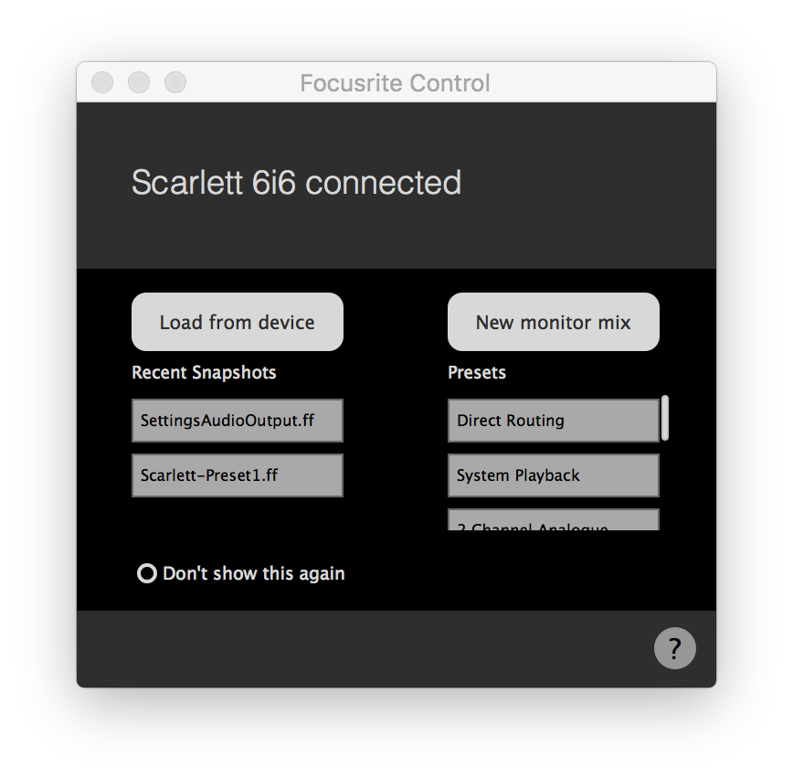
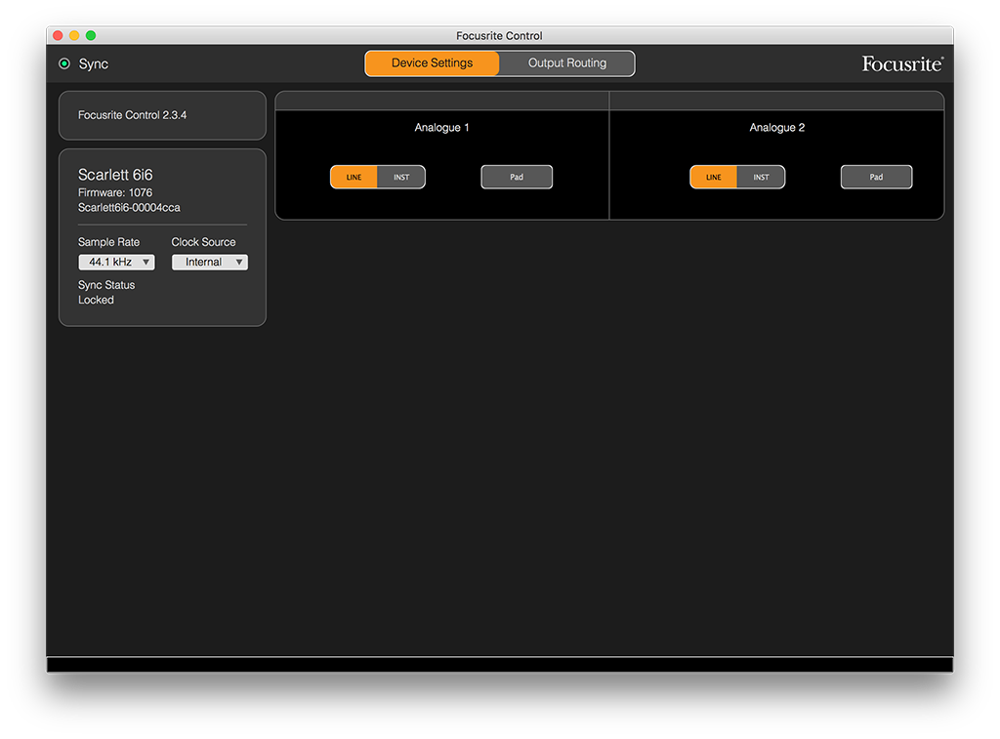
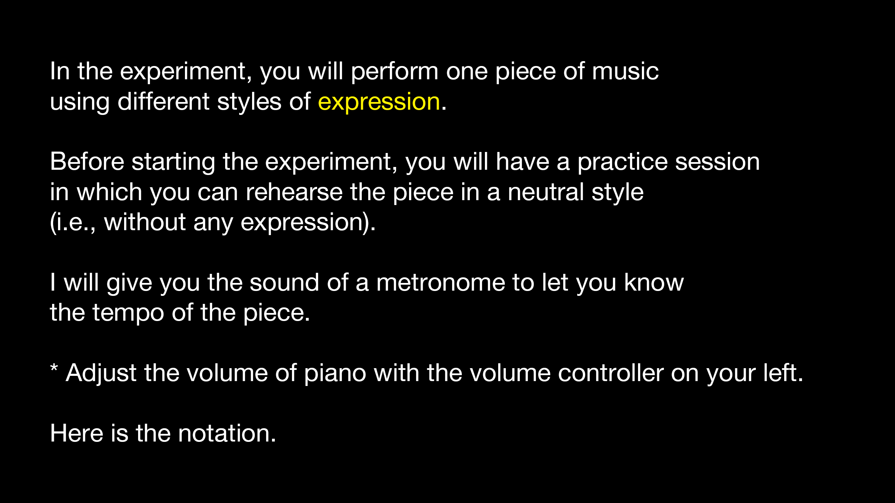
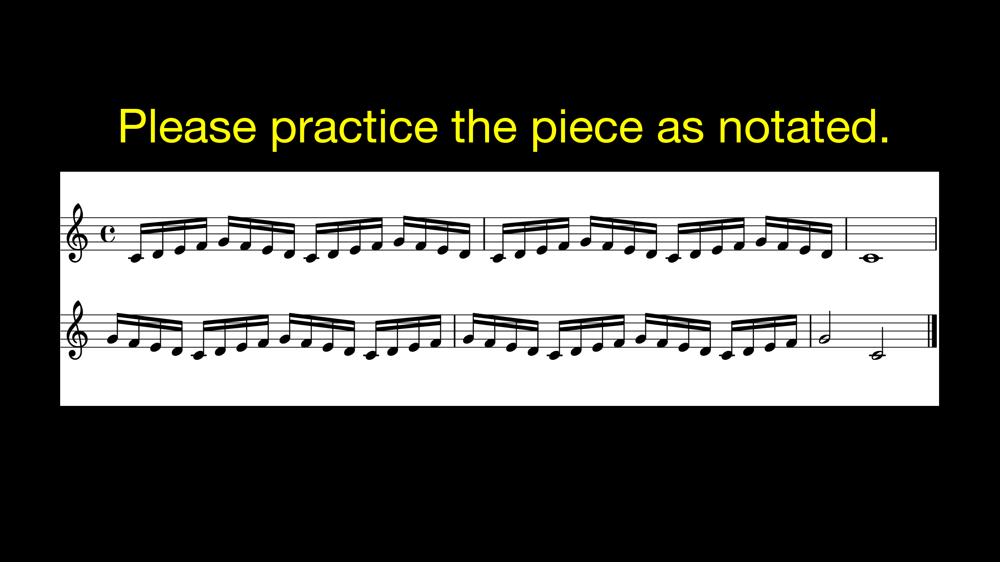
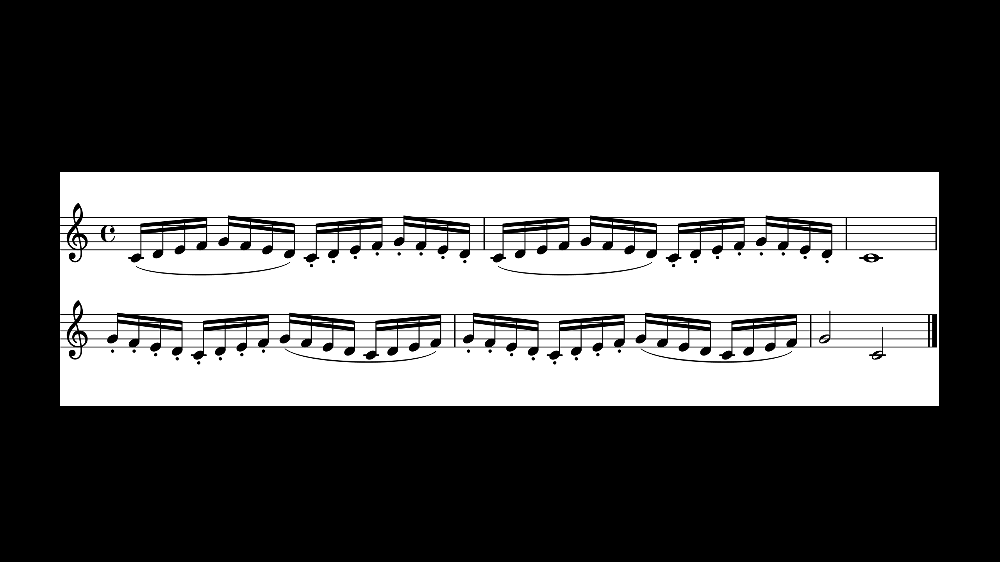
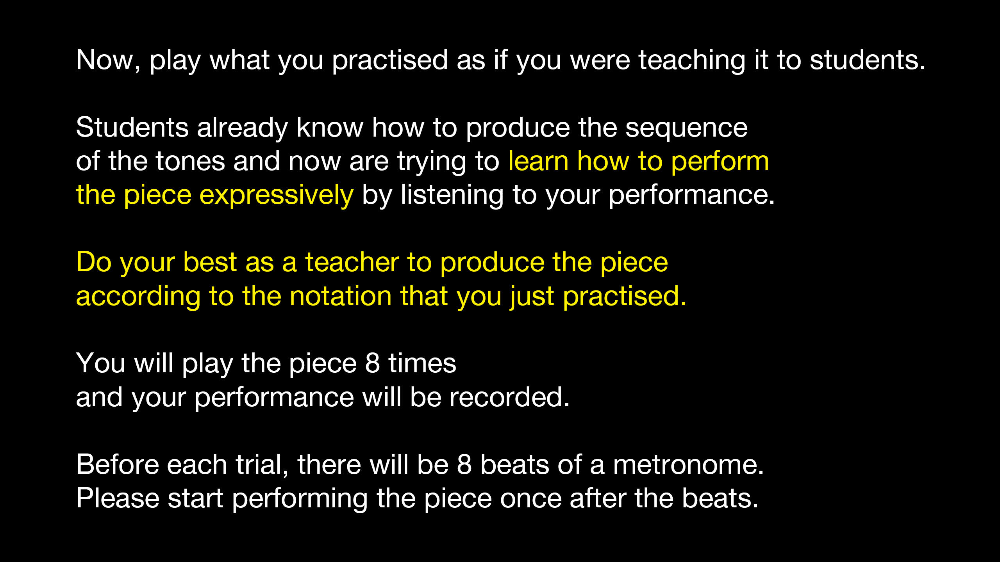
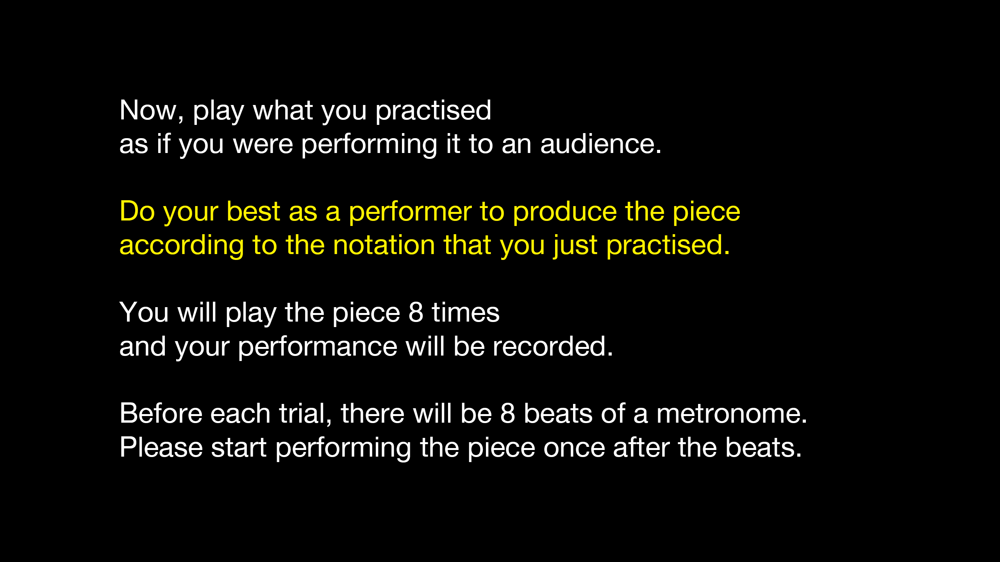

---
output:
  html_document: default
---

---
title: "Instruction"
author: "Atsuko Tominaga"
date: "13/01/2019"
output:
  html_document:
    css: style.css
---

```{r setup, include=FALSE}
knitr::opts_chunk$set(echo = F, fig.align = 'center')
# Install and load packages
if (!require("rmarkdown")) {install.packages("rmarkdown"); require("rmarkdown")}
```

<style type="text/css">
/* Whole document: */
body{
  font-family: Helvetica;
  font-size: 14pt;
}
span{
  color:red
}
</style>

## PARTICIPANT RECRUITMENT:

- More than 10 years experience to play the piano
- Basic English skills

## BEFORE PARTICIPANT ARRIVES:
- Devices
1. Connect the audio interface (Focusrite Scarlett 6i6) to Macbook Pro.
2. Connect two headphones to the audio interface.
3. Connect the piano to the audio interface.
4. Turn on the piano, the audio interface and the screen in front of the piano.
5. Open “Focusrite Control” app { width=5% } and click “Load from device”.

{ width=50% }
{ width=80% }

6. Go to “Device Settings” and click “LINE” for Analogue 1.

{ width=80% }

If you don’t see the images above, go to File >> Preset >> select “Analogue + Digital”.
Adjust the volume of the headphone so that it sounds naturally.

- Max

1. Go to Desktop >> Atsuko >> expertpiano >> open the “mainPatch.maxpat” and the “imageDisplay.maxpat”.
2. Move the window of the “imageDisplay.maxpat” to the right (on the screen in front of the piano”) and press F for a fullscreen mode.
3. Read the instruction for the “mainPatch.maxpat" below.
    + Start a trial with the A key.
    + Stop a trial with the D key.
    + If you want to record the same trial again, use the reset button.

4. Press the "Metro" button on the blue patcher to make sure the sound of a metronome comes from the headphone, not from the computer speaker.
5. Also check whether the piano sounds come from the headphone and MIDI inputs are correctly responded on the green patcher (Pitch and Velocity should change according to key presses).
6. If the sound of the metronome and the piano does not come from the computer speaker, go to System Preference >> Sound >> Output >> select “Scarllet 6i6 USB”.
7. Click the “inst_g1” button to show a general instruction on the “imageDisplay.maxpat”.
8. Enter SubNr for the current participant.

## WHEN PARTICIPANT ARRIVES:

- *Italic*: Verbal instruction
- **[  ]**: What to do

### Introduction
<span>
*Thank you for participating in the experiment. The aim of the experiment is to investigate how people play a piece of music expressively. The experiment is going to last about one hour.*<br>
*If you have any questions or concerns, please ask the experimenter at any time about the nature of the study or the methods we are using. Also, you have the right to withdraw from the experiment at any time.*<br>
*Before we start the experiment, please read the informed consent form carefully and fill it out if you agree to take part in the study.*
</span>

**[ Collect the informed consent form ]**

### Practice session

**[ Click “inst_1” ]**

{ width=80% }

**[ Click “stim_n” ]**

{ width=80% }

**[ Click “Metro” ]**

<span>
*Please practise until you feel that you confortably perform the piece without pitch errors. After practice, we will have a brief test to make sure you can perform the piece. Also, you don't have to memorise the piece as you can see sheet music in front of you. Let me know when you are ready for the brief test.*
</span>

**[ Let the participant practise the piece ]**

**[ Click "inst_2" ]**

{ width=80% }

**[ Check whether he or she can produce the sound without pitch errors twice consecutively]**

- If he or she cannot perform the piece within **5 attempts**, he or she cannot continue the experiment.

**[ Click “Black” ]**

### Experiment

- Participants whose SubNr is odd start from the teaching condition whereas those whose SubNr is even start from the performing condition.
- Please see the order of the stimuli on the blue patcher.

#### 1) Teaching condition
> 1st Stimulus

<span>
*You are now going to perform the piece in an expressive style indicated by the musical notation. I will show sheet music with the musical notation on the screen in front of you. Please read the notation and if you have any question, please ask me now (Also explain the main information of the expression). If you don't have any question, I will give you the sound of the metronome and please perform the piece according to the notation.*
</span>

**[ Open practicePatch ]**

**[ Click 1st Stimulus ]**

**[ Explain the musical notation]**

{ width=80% }

**[ Ask the participant to play the piece with the expressions 5 times ]**

<span>
*Thank you. Do you have any questions?*
</span>

**[ Click “inst_t” ]**

{ width=80% }

**[ 1 - 8 trials ]**

> 2nd Stimulus

<span>
*Thank you. Now, we are moving on to the different musical notation. Again, I will show sheet music with the musical notation on the screen in front of you. Please read the notation and perform the piece 5 times according to the notation.*
</span>

**[ Click 2nd Stimuli ]**

**[ Explain the musical notation]**

{ width=80% }

**[ Ask the participant to play the piece with the expression 5 times ]**

<span>
*Thank you. Do you have any questions?*
</span>

**[ Click “inst_t” ]**

**[ 1 - 8 trials ]**

<span>
*Thank you. Next, you will perform the same piece again but in a different condition.*
</span>

#### 2) Performing condition
> 1st Stimulus

<span>
*You are now going to perform the piece in an expressive style indicated by the musical notation. I will show sheet music with the musical notation on the screen in front of you. Please read the notation and perform the piece 5 times according to the notation.*
</span>

**[ Click 1st Stimulus ]**

**[ Explain the musical notation]**

**[ Ask the participant to play the piece with the expression 5 times ]**

<span>
*Thank you. Do you have any questions?*
</span>

**[ Click “inst_p” ]**

{ width=80% }

**[ 1 - 8 trials ]**

> 2nd Stimulus

<span>
*Thank you. Now, we are moving on to the different musical notation. Again, I will show sheet music with the musical notation on the screen in front of you. Please read the notation and perform the piece 5 times according to the notation.*
</span>

**[ Click 2nd Stimulus ]**

**[ Explain the musical notation]**

**[ Ask the participant to play the piece with the expression 5 times ]**

<span>
*Thank you. Do you have any questions?*
</span>

**[ Click “inst_p” ]**

**[ 1 - 8 trials ]**

### Questionnaire

<span>
*Thank you. This is the end of the experiment. Lastly, could you please fill in the questionnaire?*
</span>

**[ Collect the short questionnaire ]**

<span>
*Thank you for coming today and please feel free to contact me if you have any questions about my study.*
</span>

## AFTER PARTICIPANT LEAVES:
1. Check whether data were recorded correctly. If not, please leave a memo.
2. Quit Max.
3. Turn off the piano, the audio interface and the screen in front of the piano.