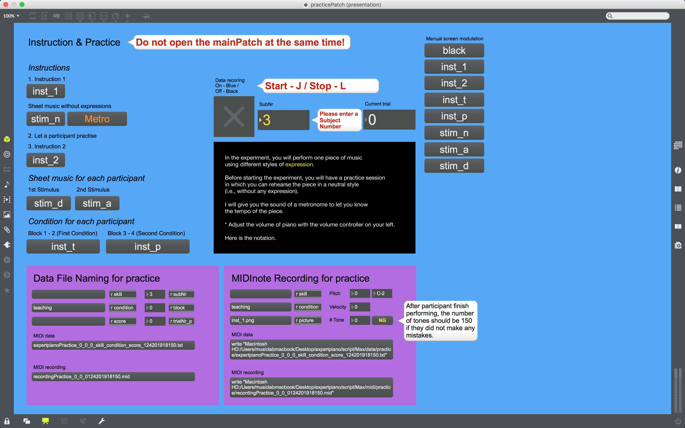
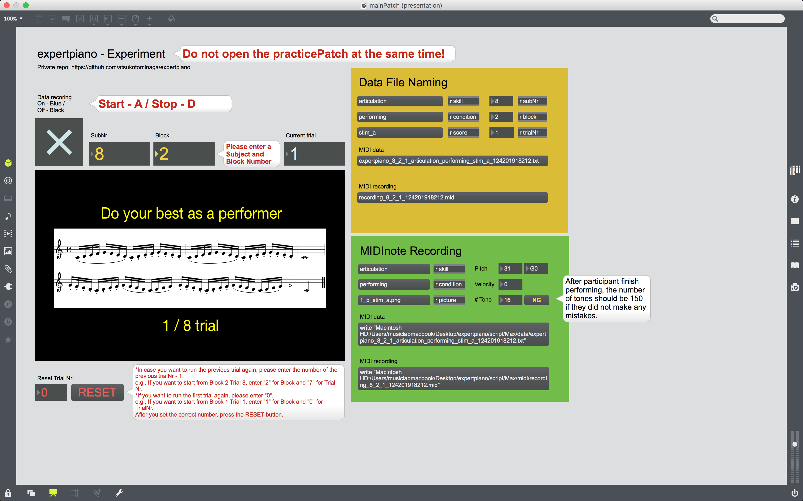
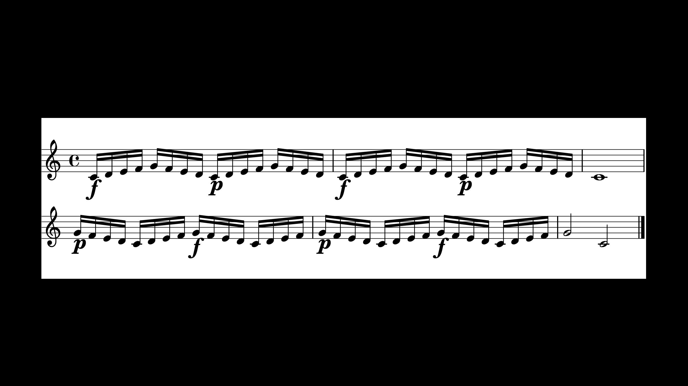

---
output:
  html_document: default
---

---
title: "Instruction"
author: "Atsuko Tominaga"
date: "24/01/2019"
output:
  html_document:
    css: style.css
---

```{r setup, include=FALSE}
knitr::opts_chunk$set(echo = F, fig.align = 'center')
# Install and load packages
if (!require("rmarkdown")) {install.packages("rmarkdown"); require("rmarkdown")}
```

<style type="text/css">
/* Whole document: */
body{
  font-family: Helvetica;
  font-size: 14pt;
}
span{
  color:red
}
</style>

## PARTICIPANT RECRUITMENT:

- More than 10 years experience to play the piano
- Basic English skills

## BEFORE PARTICIPANT ARRIVES:
- Devices
1. Connect the audio interface (Focusrite Scarlett 6i6) to Macbook Pro.
2. Connect two headphones to the audio interface.
3. Connect the piano to the audio interface.
4. Turn on the piano, the audio interface and the screen in front of the piano.
5. Open “Focusrite Control” app { width=5% } and click “Load from device”.

{ width=50% }
{ width=80% }

6. Go to “Device Settings” and click “LINE” for Analogue 1.

{ width=80% }

If you don’t see the images above, go to File >> Preset >> select “Analogue + Digital”.
Adjust the volume of the headphone so that it sounds naturally.

- Max

1. Go to Desktop >> Max alias >> open the "mainPatch.maxpat", the “practicePatch.maxpat” and the “imageDisplay.maxpat”.
2. Move the window of the “imageDisplay.maxpat” to the right (on the screen in front of the piano”) and press F for a fullscreen mode.
3. Read the instruction on the “mainPatch.maxpat" and the "practicePatch.maxpat". <span>**Both patchers cannot be opened at the same time.**</span>
4. Press the "Metro" button on the "blue patcher"practicePatcher" to make sure the sound of a metronome comes from the headphone, not from the computer speaker. <span>~~**Please do not skip this procedurea otherwise sometimes the metronome does not work properly only for the first time.** # added on 18/01/19~~</span>
5. Also check whether the piano sounds come from the headphone and MIDI inputs are correctly responded (Pitch and Velocity should change according to key presses on MIDIRecording subpatchers).
6. If the sound of the metronome and the piano does not come from the computer speaker, go to System Preference >> Sound >> Output >> select “Scarllet 6i6 USB”.
7. If you cannot still solve the problem above, please quit Max and relaunch it again. <span># added on 18/01/19</span>
8. Click the “inst_1” button to show a general instruction on the “imageDisplay.maxpat”.
9. Enter SubNr for the current participant.

### Practice Patch <span># added on 24/01/19</span>


### Main Patch <span># added on 24/01/19</span>


### Experimental Design <span># added on 24/01/19</span>
|Condition 1 (teaching / performing)|
|-----------------------------------|
|1st Stimulus (articulation / dynamics) - Block 1|
|2nd Stimulus (dynamics / articulation) - Block 2|

|Condition 2 (performing / teaching)|
|-----------------------------------|
|1st Stimulus (articulation / dynamics) - Block 3|
|2nd Stimulus (dynamics / articulation) - Block 4|

* The order of the conditions is counterbalanced across participants.
* The order of the stimuli is counterbalanced across participants, but it is fixed within one condition (e.g., if a participant start with articulation and move on dynamics in the first condition, he/she will perform in the same order.)

## WHEN PARTICIPANT ARRIVES:

- *Italic*: Verbal instruction
- **[  ]**: What to do
- Please use a checklist to make sure you don't forget each procedure.

### Introduction
<span>
*Thank you for participating in the experiment. The aim of the experiment is to investigate how people play a piece of music expressively. The experiment is going to last about one hour.*<br>
*If you have any questions or concerns, please ask the experimenter at any time about the nature of the study or the methods we are using. Also, you have the right to withdraw from the experiment at any time.*<br>
*Before we start the experiment, please read the information sheet carefully and fill it out if you agree to take part in the study.*
</span>

**[ Collect the informed consent form ]**

### Practice session

**[ Open practicePatch ]**

**[ Click “inst_1” ]**

{ width=80% }

**[ Click “stim_n” ]**

{ width=80% }

**[ Click “Metro” ]**

<span>
*Please practise until you feel that you confortably perform the piece without pitch errors. After practice, we will have a brief test to make sure you can perform the piece. Also, you don't have to memorise the piece as you can see sheet music in front of you. Let me know when you are ready for the brief test.*
</span>

**[ Let the participant practise the piece ]**

**[ Click "inst_2" ]**

{ width=80% }

**[ Check whether he or she can produce the sound without pitch errors twice consecutively]**

**[ Click "stim_n"]**

- If he or she cannot perform the piece within **5 attempts**, he or she cannot continue the experiment.

### Experiment

- Participants whose SubNr is odd start from the teaching condition whereas those whose SubNr is even start from the performing condition.
- Please see the order of the stimuli (i.e., starting from articulation or dynamics) on the practicePatcher.

#### 1) Teaching condition
> 1st Stimulus

<span>
*You are now going to perform the piece in an expressive style indicated by the musical notation. I will show sheet music with the musical notation on the screen in front of you. Please read the notation and if you have any question, please ask the experimenter now. If you don't have any question, I will give you the sound of the metronome and please perform the piece according to the notation.*
</span>

**[ Open practicePatch ]**

**[ Click 1st Stimulus ]**

**[ Explain the musical notation]**

Definition (based on Wikipedia)

- Legato: musical notes are played smoothly and connected
- Staccato: musical notes have shortened duration and are separated from each other
- Forte: louder sound
- Piano: quieter sound

{ width=80% }

**[ Check the participant to play the piece expressively without pitch errors twice consecutively ]**

<span>
*Thank you. Do you have any questions?*
</span>

**[ Click “inst_t” ]**

{ width=80% }

**[ Close practicePatch ]**

**[ Open mainPatch ]**

**[ 1 - 8 trials ]**

> 2nd Stimulus

<span>
*Thank you. Now, we are moving on to the different musical notation. Again, I will show sheet music with the musical notation on the screen in front of you. Please read the notation.*
</span>

**[ Open practicePatch ]**

**[ Click 2nd Stimuli ]**

**[ Explain the musical notation ]**

{ width=80% }

**[ Check the participant to play the piece expressively without pitch errors twice consecutively ]**

<span>
*Thank you. Do you have any questions?*
</span>

**[ Click “inst_t” ]**

**[ Close practicePatch ]**

**[ Open mainPatch ]**

**[ 1 - 8 trials ]**

<span>
*Thank you. Next, you will perform the same piece again but in a different condition.*
</span>

#### 2) Performing condition
> 1st Stimulus

<span>
*You are now going to perform the piece in an expressive style indicated by the musical notation. I will show sheet music with the musical notation on the screen in front of you. Please read the notation.*
</span>

**[ Open practicePatch ]**

**[ Click 1st Stimulus ]**

**[ Explain the musical notation]**

**[ Check the participant to play the piece expressively without pitch errors twice consecutively ]**

<span>
*Thank you. Do you have any questions?*
</span>

**[ Click “inst_p” ]**

{ width=80% }

**[ Close practicePatch ]**

**[ Open mainPatch ]**

**[ 1 - 8 trials ]**

> 2nd Stimulus

<span>
*Thank you. Now, we are moving on to the different musical notation. Again, I will show sheet music with the musical notation on the screen in front of you. Please read the notation.*
</span>

**[ Open practicePatch ]**

**[ Click 2nd Stimulus ]**

**[ Explain the musical notation]**

**[ Check the participant to play the piece expressively without pitch errors twice consecutively ]**

<span>
*Thank you. Do you have any questions?*
</span>

**[ Click “inst_p” ]**

**[ Close practicePatch ]**

**[ Open mainPatch ]**

**[ 1 - 8 trials ]**

### Questionnaire

<span>
*Thank you. This is the end of the experiment. Lastly, could you please fill in the questionnaire?*
</span>

**[ Collect the short questionnaire ]**

<span>
*Thank you for coming today and please feel free to contact me if you have any questions about my study.*
</span>

## AFTER PARTICIPANT LEAVES:
1. Check whether data were recorded correctly. If not, leave a memo on the checklist.
2. Quit Max.
3. Turn off the piano, the audio interface and the screen in front of the piano.

## Additional instructions after the pilot has started (18/01/19 Updated)
- If participants ask you whether they should keep the tempo or not, please let them know that they can play the piece as they like, but keep in mind the metronome tells you the original tempo of this piece.
- If participants ask anything related to detailed information about each skill (e.g., deeper legato? normal/subito forte?), just ask them to play as they like.
- If participants start playing before the metronome beats, please record the same trial again.

## Memo for patchers (24/01/19 Updated)
- Change variable names for data storage on practice sub-patchers (data / data_p) <span># added on 20/01/19</span>
- Add a tone counter to detect error (if the number of tones is not equal to 150 after performing, there will be an error in performance) <span># added on 24/01/19</span>